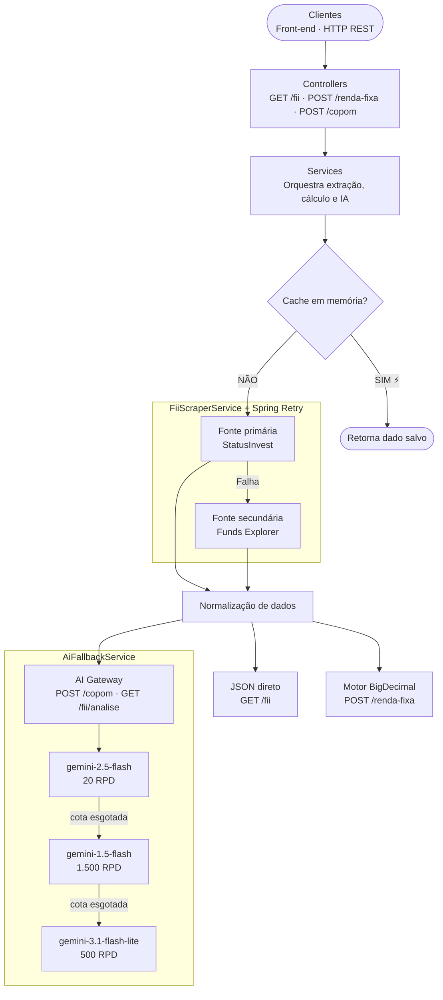

# 🏗️ Motor Financeiro & AI Gateway


> Sistema de análise financeira determinística acoplado a uma camada cognitiva de IA para interpretação de cenários macroeconômicos. Desenvolvido integralmente em ambiente online via **GitHub Codespaces**, sem dependências de setup local.

---

## 📋 Índice

- [Visão Geral](#visão-geral)
- [Arquitetura do Sistema](#arquitetura-do-sistema)
- [Fases Implementadas](#fases-implementadas)
- [API Reference](#api-reference)
- [Camada Cognitiva — Agentes de IA](#camada-cognitiva--agentes-de-ia)
- [Motor Determinístico — Renda Fixa](#motor-determinístico--renda-fixa)
- [Frontend](#frontend)
- [Como Rodar](#como-rodar)
- [Stack Tecnológico](#stack-tecnológico)
- [Decisões Arquiteturais](#decisões-arquiteturais)
- [Estratégia de Deploy](#estratégia-de-deploy)

---

## Visão Geral

O **Motor Financeiro** é um monolito modular construído em Java 23 com Spring Boot 3.4.2. Atua como:

1. **Motor determinístico** — cálculos financeiros precisos em `BigDecimal` (IR, IOF, juros compostos, ganho real)
2. **Gateway de dados** — scraping resiliente de FIIs com fallback automático entre fontes
3. **Gateway cognitivo** — dois agentes de IA especializados com cadeia de fallback entre modelos Gemini
4. **Interface web** — frontend responsivo com tema claro/escuro servido pelo próprio Spring Boot

### Princípio Central

| Camada | Responsabilidade | Tecnologia |
|---|---|---|
| **Motor Determinístico** | Cálculos tributários e financeiros | Java 23 + `BigDecimal` |
| **Extração de Dados** | Scraping resiliente com fallback | Jsoup + Spring Retry |
| **Camada Cognitiva** | Análise semântica e linguagem natural | Spring AI 1.1.7 + Gemini |
| **Persistência** | Histórico de consultas | PostgreSQL + Spring Data JPA |
| **Interface** | Frontend responsivo | HTML/CSS/JS (single-page) |

> **Regra absoluta:** nenhum valor financeiro exibido ao usuário passa pela IA. Todo número é gerado, validado e formatado pelo código Java antes de qualquer interação com o modelo de linguagem.

---

## Arquitetura do Sistema



---

## Fases Implementadas

### ✅ Fase 1 — Fundação, Extração e Resiliência

Infraestrutura base com scraping resiliente de dados de FIIs.

| Componente | Descrição |
|---|---|
| `FiiScraperStrategy` | Interface Strategy Pattern para múltiplas fontes |
| `StatusInvestScraperStrategy` | Scraping HTML via Jsoup com seletores CSS |
| `FundsExplorerScraperStrategy` | Fonte secundária com estratégia de extração por texto |
| `FiiService` | Orquestra cache + primary + fallback + health check |
| `FiiController` | `GET /api/v1/fii/{ticker}` |
| `@Scheduled` Health Check | Monitora saúde dos endpoints externos a cada hora |
| Cache em memória | `@EnableCaching` mitigando Rate Limit |

**Descoberta técnica relevante:** O StatusInvest usa SSR (Server-Side Rendering) — os dados de DY e P/VP chegam embutidos no HTML da página, sem endpoint JSON separado. A solução foi scraping direto via Jsoup com seletores CSS. O Cloudflare bloqueia IPs de datacenter para o StatusInvest; o Funds Explorer atua como fonte principal em ambiente Codespace.

---

### ✅ Fase 2 — Motor Determinístico de Renda Fixa

Núcleo matemático para comparativo de investimentos sem IA.

**Regras tributárias implementadas:**

| Componente | Detalhes |
|---|---|
| `Calculations.java` | 100% `BigDecimal`, `RoundingMode.HALF_UP`, sem `float`/`double` |
| Tabela Regressiva de IR | 22,5% → 20% → 17,5% → 15% conforme prazo |
| IOF Regressivo | Tabela de 30 dias (Decreto 6.306/2007) |
| Isenções | LCI, LCA, CRI, CRA, Debêntures Incentivadas |
| Juros compostos | Com e sem aportes mensais (anuidade ordinária) |
| Equação de Fisher | Ganho real descontando inflação acumulada do período |
| Taxa mensal equivalente | `(1 + taxa_anual)^(1/12) - 1` |

**Tipos suportados:** `CDB`, `LCI`, `LCA`, `CRI`, `CRA`, `TESOURO_SELIC`, `TESOURO_IPCA`, `TESOURO_PREFIXADO`

---

### ✅ Fase 3 — Camada Cognitiva (Spring AI + Gemini)

Dois agentes de IA especializados com fallback automático entre modelos.

#### Agente 1 — Auditor de FIIs
Classifica o fundo por tipo, avalia P/VP, analisa histórico, gera simulador de rendimento e veredito final (APROVADO / EM OBSERVAÇÃO / REPROVADO).

#### Agente 2 — Tradutor do COPOM
Identifica viés hawkish/dovish/neutro, extrai frases-chave do texto oficial e traduz o impacto direto em renda fixa e FIIs, incluindo rotação de portfólio.

#### AiFallbackService — Cadeia de Modelos
```
gemini-2.5-flash (20 RPD)
        ↓ [429 / timeout]
gemini-1.5-flash (1.500 RPD)
        ↓ [429 / timeout]
gemini-3.1-flash-lite (500 RPD)
        ↓ [todos falharam]
503 — "Serviço temporariamente indisponível"
```

O `AiFallbackService` detecta erros recuperáveis (`429`, `RESOURCE_EXHAUSTED`, `timeout`, `503`) e redireciona para o próximo modelo de forma transparente. Erros não recuperáveis (`400`, `401`, `403`) propagam imediatamente.

---

### ✅ Fase 4 — Persistência de Dados

| Componente | Descrição |
|---|---|
| PostgreSQL 16 | Containerizado via Docker Compose |
| `FiiHistory` | Entidade JPA com histórico de consultas de FIIs |
| `FiiHistoryRepository` | Spring Data JPA com query derivada |
| `GlobalExceptionHandler` | `@ControllerAdvice` com respostas JSON padronizadas |
| `.env` | Credenciais via variáveis de ambiente (nunca hardcoded) |

---

### ✅ Fase 5 — Frontend

Interface web single-page servida pelo próprio Spring Boot (`/static/index.html`), sem build tools.

| Feature | Detalhes |
|---|---|
| Tema claro/escuro | Detecta `prefers-color-scheme`, persiste via `localStorage` |
| Responsivo | CSS Grid/Flexbox, funciona em mobile e desktop |
| Tipografia distintiva | `Fraunces` (serif) + `Bricolage Grotesque` + `Fira Mono` |
| Glossário por aba | Termos financeiros explicados para o investidor iniciante |
| Disclaimer legal | Rodapé com aviso de responsabilidade em todas as telas |

---

## API Reference

### FIIs

```bash
# Buscar dados de um FII
GET /api/v1/fii/{ticker}

# Exemplo
curl http://localhost:8080/api/v1/fii/MXRF11
```

```bash
# Buscar dados + análise qualitativa de IA
GET /api/v1/fii/{ticker}/analise

# Exemplo
curl http://localhost:8080/api/v1/fii/XPLG11/analise
```

```bash
# Histórico de consultas gravadas no PostgreSQL
GET /api/v1/fii/{ticker}/history

# Limpar cache de um ticker específico
POST /api/v1/fii/{ticker}/cache/clear
```

---

### Renda Fixa

```bash
POST /api/v1/renda-fixa/comparar
Content-Type: application/json

{
  "valorInicial":  10000.00,
  "aporteMensal":    500.00,
  "prazoMeses":        24,
  "inflacaoAnual":    4.50,
  "investimentos": [
    { "tipo": "CDB",          "taxaAnual": 12.50 },
    { "tipo": "LCI",          "taxaAnual":  9.00 },
    { "tipo": "LCA",          "taxaAnual":  9.50 },
    { "tipo": "TESOURO_SELIC","taxaAnual": 10.75 }
  ]
}
```

Retorna comparativo ordenado do maior para o menor montante líquido, com IR pago, rentabilidade líquida e ganho real por investimento.

---

### COPOM

```bash
POST /api/v1/copom/analisar
Content-Type: application/json

{
  "textoAta": "O Comitê de Política Monetária decidiu, por unanimidade,
               elevar a taxa Selic em 1,00 ponto percentual para 13,25%
               ao ano. O ambiente inflacionário permanece desafiador..."
}
```

Retorna viés (HAWKISH/DOVISH/NEUTRO), resumo, impacto em renda fixa e FIIs, frases-chave do texto e rotação de portfólio recomendada.

---

### Health Check

```bash
GET /api/v1/health
# → { "status": "UP", "service": "motor-financeiro", "timestamp": "..." }
```

---

## Camada Cognitiva — Agentes de IA

### Agente 1: Auditor de FIIs

**Endpoint:** `GET /api/v1/fii/{ticker}/analise`

**O que analisa:**
- Classificação do tipo (Papel / Tijolo — segmento / Fiagro / FoF)
- P/VP com teto por tipo (Papel: 1,05 · Tijolo: 1,10)
- DY frente ao CDI atual
- Análise histórica: resistência a crises, tendência 3 anos, evolução do patrimônio
- Simulador: cotas com R$ 1.000, rendimento mensal e 12 meses estimados
- Critérios condicionais por tipo (vacância/WALT para Tijolo; indexadores para Papel)
- Veredito final: **APROVADO ✅** / **EM OBSERVAÇÃO 🟡** / **REPROVADO ❌**

**Princípio:** Os números (preço, DY, P/VP) vêm do motor Java. A IA só interpreta — nunca calcula.

---

### Agente 2: Tradutor do COPOM

**Endpoint:** `POST /api/v1/copom/analisar`

**O que analisa:**
- Viés da política monetária: **HAWKISH 🦅** / **DOVISH 🕊️** / **NEUTRO ⚖️**
- Parsing semântico em 3 blocos: balanço de riscos, ancoragem das expectativas, forward guidance
- Citações exatas do texto que evidenciam o viés
- Impacto separado para renda fixa (pós-fixado vs prefixado) e FIIs (papel vs tijolo)
- Rotação de portfólio: instrução direta de ação para hoje

**Fonte:** Atas e comunicados disponíveis em [bcb.gov.br/publicacoes/notacopom](https://www.bcb.gov.br/publicacoes/notacopom)

---

## Motor Determinístico — Renda Fixa

A classe `Calculations.java` implementa todo o motor financeiro em `BigDecimal` puro:

```java
// Taxa mensal equivalente (regime composto)
BigDecimal taxaMensal = Calculations.taxaMensalEquivalente(new BigDecimal("12.5"));

// Montante final com aportes mensais
// FV = PV × (1+r)^n  +  PMT × [(1+r)^n - 1] / r
BigDecimal montante = Calculations.calcularMontante(pv, pmt, taxaMensal, meses);

// IR — Tabela Regressiva (Lei 11.033/2004)
BigDecimal aliquota = Calculations.aliquotaIR(diasCorridos); // 0.225 | 0.20 | 0.175 | 0.15

// IOF — Decreto 6.306/2007 (30 primeiros dias)
BigDecimal iof = Calculations.calcularIOF(lucroBruto, diasCorridos);

// Ganho Real — Equação de Fisher
// Real = [(1 + nominal) / (1 + inflação)] - 1
BigDecimal ganhoReal = Calculations.calcularGanhoReal(rentLiquida, inflacaoAnual, meses);
```

---

## Frontend

A interface é um arquivo HTML único em `src/main/resources/static/index.html`, servido automaticamente pelo Spring Boot em `http://localhost:8080`.

**Abas disponíveis:**
- **FIIs** — busca de dados + análise completa de IA
- **Renda Fixa** — comparativo determinístico com IR, IOF e ganho real
- **COPOM** — análise semântica de comunicados do Banco Central

**Funcionalidades:**
- Tema claro/escuro com detecção automática do sistema operacional
- Responsivo para mobile, tablet e desktop
- Glossário de termos financeiros por aba
- Disclaimer legal fixo no rodapé

---

## Como Rodar

### Pré-requisitos

- Java 23
- Maven 3.9+
- Docker (para o PostgreSQL)
- Conta gratuita no [Google AI Studio](https://aistudio.google.com) para a GEMINI_API_KEY

### Setup inicial

```bash
# 1. Clone o repositório
git clone https://github.com/moiseslemosz/financial-engine.git
cd financial-engine

# 2. Configure as variáveis de ambiente
cp .env.example .env
nano .env  # Preencha DB_PASSWORD e GEMINI_API_KEY
```

### Rodando com Makefile

```bash
make db    # Sobe o PostgreSQL via Docker Compose
make run   # Sobe a aplicação (já verifica se o banco está no ar)
make stop  # Derruba o banco
make logs  # Logs do PostgreSQL
```

> O `make run` detecta automaticamente se o banco está parado e o sobe antes da aplicação.

### Variáveis de ambiente (`.env`)

```env
DB_HOST=localhost
DB_PORT=5432
DB_NAME=motor_financeiro
DB_USER=postgres
DB_PASSWORD=sua_senha_forte_aqui

# Obtenha em: https://aistudio.google.com → Get API Key
GEMINI_API_KEY=sua_chave_aqui
```

### Endpoints de teste

```bash
# Health check
curl http://localhost:8080/api/v1/health

# Dados de FII
curl http://localhost:8080/api/v1/fii/MXRF11

# FII com análise de IA
curl http://localhost:8080/api/v1/fii/XPLG11/analise

# Frontend
# Acesse http://localhost:8080 no browser
```

---

## Stack Tecnológico

| Categoria | Tecnologia | Versão |
|---|---|---|
| Linguagem | Java | 23 |
| Framework | Spring Boot | 3.4.2 |
| Camada de IA | Spring AI | 1.1.7 |
| Modelo de IA | Gemini (Google AI Studio) | 2.5-flash / 1.5-flash / 3.1-flash-lite |
| Scraping | Jsoup | 1.17.2 |
| Resiliência | Spring Retry | — |
| Banco de Dados | PostgreSQL | 16 |
| ORM | Spring Data JPA + Hibernate | 6.6.5 |
| Conteinerização | Docker Compose | — |
| Frontend | HTML/CSS/JS (vanilla) | — |
| Fontes | Fraunces + Bricolage Grotesque + Fira Mono | — |
| Ambiente de dev | GitHub Codespaces | — |

---

## Decisões Arquiteturais

### Por que BigDecimal e não double?

Operações com `double` acumulam erros de ponto flutuante que em cálculos financeiros geram divergências de centavos. `BigDecimal` com `RoundingMode.HALF_UP` garante precisão exata em todos os cálculos de IR, IOF e ganho real.

### Por que scraping HTML e não API JSON?

O StatusInvest usa SSR (Server-Side Rendering): DY e P/VP chegam embutidos no HTML da página, sem endpoint JSON público separado. Adicionalmente, o Cloudflare bloqueia IPs de datacenter (como o do Codespace) para o StatusInvest — o Funds Explorer funciona como fonte principal sem esse bloqueio.

### Por que a IA nunca toca nos cálculos?

Modelos de linguagem são não-determinísticos e podem alucinar valores numéricos. Para um sistema financeiro, um único número errado pode levar a decisões de investimento incorretas. A separação é arquitetural: o motor Java garante precisão, a IA garante clareza na linguagem natural.

### Por que AiFallbackService em vez de @Retryable?

O `@Retryable` reexecuta o mesmo método — inadequado quando o problema é cota esgotada em um modelo específico. O `AiFallbackService` troca o *modelo* a cada tentativa, mantendo a mesma lógica de chamada. Isso permite usar 3 modelos distintos com orçamentos de RPD diferentes sem duplicar código.

### Por que monolito modular e não microsserviços?

A separação em microsserviços adicionaria overhead operacional (service discovery, autenticação entre serviços, rede) sem benefício real para um portfólio individual. O monolito modular com pacotes bem definidos (`controller`, `service`, `dto`, `model`, `util`, `exception`) entrega a mesma clareza arquitetural com muito menos complexidade de deploy.

---

## Estratégia de Deploy

### Etapa 1 — PaaS Zero Cost (validação rápida)

| Serviço | Plataforma | Custo |
|---|---|---|
| Aplicação Spring Boot | Koyeb | Gratuito |
| Banco de dados PostgreSQL | Neon.tech ou Supabase | Gratuito |
| IA Generativa | Gemini API (AI Studio) | Gratuito |

O Koyeb mantém contêineres ativos nativamente na camada gratuita, evitando o cold start de 30-60s do Render.

### Etapa 2 — AWS EC2 (diferencial de portfólio)

| Serviço | Configuração | Custo |
|---|---|---|
| EC2 | `t2.micro` com Ubuntu | Free Tier 12 meses |
| PostgreSQL | Contêiner Docker na EC2 | Incluso |
| IA | Gemini API | Gratuito |

A migração para EC2 agrega domínio de Security Groups, VPC, SSH com chave privada e monitoramento — habilidades altamente valorizadas em entrevistas técnicas seniores.

---

## Estrutura de Pacotes

```
src/main/java/com/motorfinanceiro/
├── config/
│   └── AiConfig.java                    # Bean do ChatClient (Spring AI)
├── controller/
│   ├── FiiController.java               # Rotas de FIIs
│   ├── RendaFixaController.java         # Rota de comparativo
│   └── CopomController.java             # Rotas de IA (COPOM + FII analise)
├── service/
│   ├── AiFallbackService.java           # Gateway com cadeia de fallback
│   ├── CopomAnalyzerService.java        # Agente: Tradutor do COPOM
│   ├── FiiAuditorService.java           # Agente: Auditor de FIIs
│   ├── FiiService.java                  # Orquestra cache + scraping
│   ├── FiiScraperStrategy.java          # Interface Strategy Pattern
│   ├── StatusInvestScraperStrategy.java # Fonte primária
│   ├── FundsExplorerScraperStrategy.java# Fonte secundária (fallback)
│   └── RendaFixaService.java            # Motor de cálculo determinístico
├── dto/                                 # 8 Records imutáveis
├── model/
│   ├── FiiHistory.java                  # Entidade JPA
│   └── TipoInvestimento.java            # Enum com flag de isenção
├── exception/
│   ├── GlobalExceptionHandler.java      # @ControllerAdvice centralizado
│   ├── ScraperException.java            # Falha de scraping
│   └── AiQuotaExceededException.java    # Cadeia de IA esgotada
└── util/
    └── Calculations.java                # Motor BigDecimal (puro, sem IA)

src/main/resources/
├── prompts/
│   ├── fii-auditor.st                   # System prompt do Auditor de FIIs
│   └── copom-translator.st              # System prompt do Tradutor COPOM
├── static/
│   └── index.html                       # Frontend completo (single-page)
└── application.properties
```

---

*Documentação gerada em Jun/2026 — versão 2.0*