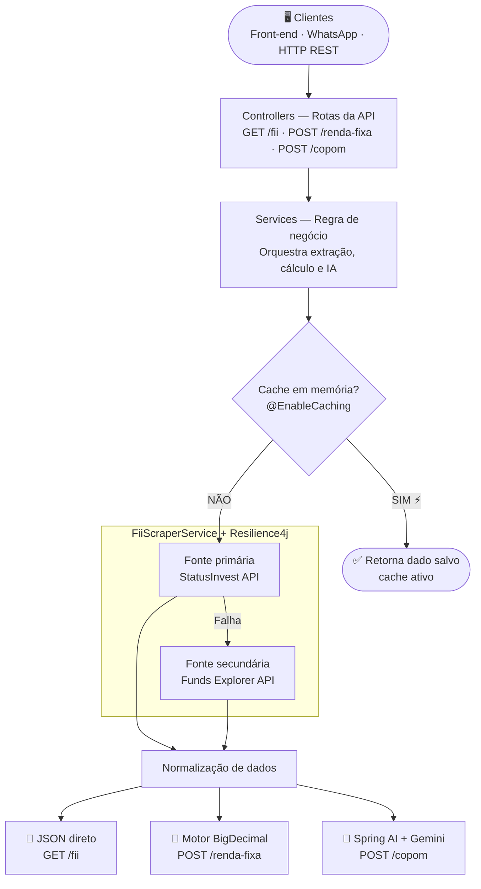

# 🏗️ Motor Financeiro & AI Gateway


> Sistema de análise financeira determinística acoplado a uma camada cognitiva de IA para interpretação de cenários macroeconômicos.

---

## 📋 Índice

- [Visão Geral](#visão-geral)
- [Arquitetura do Sistema](#arquitetura-do-sistema)
- [Roadmap de Desenvolvimento](#roadmap-de-desenvolvimento)
- [Como Rodar o Projeto](#como-rodar-o-projeto)
- [Estratégia de Deploy](#estratégia-de-deploy)
- [Stack Tecnológico](#stack-tecnológico)
- [Decisões Arquiteturais](#decisões-arquiteturais)

---

## Visão Geral

O sistema é um **Monolito Modular** construído em **Java 25 com Spring Boot**. Atua como um motor determinístico de cálculos financeiros e extração de dados via APIs (primária e secundária), acoplado a uma camada cognitiva (Spring AI + Gemini) para interpretação de cenários macroeconômicos.

### Princípio Central

| Camada | Responsabilidade | Tecnologia |
|---|---|---|
| **Motor Determinístico** | Cálculos tributários e financeiros | Java 25 + `BigDecimal` |
| **Extração de Dados** | Scraping resiliente com fallback | Jsoup + Resilience4j |
| **Camada Cognitiva** | Análise semântica e tradução de linguagem natural | Spring AI + Gemini API |

> A matemática financeira é executada **exclusivamente pelo código**, garantindo precisão absoluta. A IA atua apenas na orquestração de linguagem natural e análise semântica — nunca em cálculos.

---

## Arquitetura do Sistema



> Cada rota aciona **apenas a camada que precisa**. O motor de cálculo nunca toca na IA e a IA nunca toca nos cálculos.

---

## Roadmap de Desenvolvimento

O projeto segue a metodologia de **MVPs incrementais**. Nenhuma fase deve ser iniciada sem que a anterior esteja testada e retornando dados limpos.

---

### ✅ Fase 1 — Fundação, Extração e Resiliência (MVP 1)

**Objetivo:** Levantar a infraestrutura base e provar que o sistema consegue ler dados do mercado financeiro de forma resiliente e protegida.

| Passo | Descrição |
|---|---|
| 1.1 | Inicializar o projeto Spring Boot com Java 25 (Web, Caching, Retry) |
| 1.2 | Criar os pacotes arquiteturais: `controller`, `service`, `dto`, `exception`, `config` |
| 1.3 | Ativar Cache em Memória nativo (`@EnableCaching`) para mitigar Rate Limit durante testes locais |
| 1.4 | Mapear o endpoint interno (API não-oficial) do StatusInvest via DevTools — evita gargalos de renderização JavaScript que paralisariam um parser HTML estático |
| 1.5 | Implementar `FiiResponseDTO` usando **Java Records** para garantir imutabilidade dos dados de preço, P/VP e Dividend Yield |
| 1.6 | Implementar Mecanismo de Fallback (`@Retryable`): se a fonte primária falhar (403, 500 ou dados nulos), o fluxo desvia automaticamente para a fonte secundária |
| 1.7 | Criar Health Check Assíncrono (`@Scheduled` a cada hora) para monitorar a saúde e o contrato dos endpoints externos em background, emitindo alertas nos logs antes que o usuário final perceba qualquer falha |
| 1.8 | Expor a rota `GET /api/v1/fii/{ticker}` no `FiiController` e validar o retorno do JSON purificado via Postman |

---

### ⚙️ Fase 2 — Motor Determinístico (MVP 2)

**Objetivo:** Construir o núcleo matemático que calcula rentabilidade de Renda Fixa sem interferência ou alucinação da camada de IA.

| Passo | Descrição |
|---|---|
| 2.1 | Criar a classe utilitária `Calculations` utilizando estritamente `BigDecimal` para evitar erros de ponto flutuante |
| 2.2 | Codificar as regras tributárias brasileiras: Tabela Regressiva de IR, isenções de LCI/LCA/CRI/CRA e IOF regressivo para os primeiros 30 dias |
| 2.3 | Criar a rota `POST /api/v1/renda-fixa/comparar` executando juros compostos com e sem aportes mensais, e a equação exata do Ganho Real descontando inflação |

---

### 🤖 Fase 3 — Camada Cognitiva (MVP 3)

**Objetivo:** Integrar a IA generativa de forma calibrada para análises qualitativas.

| Passo | Descrição |
|---|---|
| 3.1 | Adicionar e configurar o **Spring AI** com as credenciais da API do Gemini |
| 3.2 | Estruturar a árvore de decisão semântica dos agentes (Tradutor do Copom, Auditor de FIIs) dentro do `system_instructions`, com regras ocultas para evitar vazamento de opções estruturais no output |
| 3.3 | Conectar o serviço de orquestração: o payload numérico gerado pelo motor Java é enviado para a IA gerar o veredito final em linguagem natural acessível |

---

### 🗄️ Fase 4 — Persistência de Dados (MVP 4)

**Objetivo:** Transicionar do cache em memória para armazenamento persistente de longo prazo.

| Passo | Descrição |
|---|---|
| 4.1 | Configurar **PostgreSQL** em ambiente conteinerizado via Docker Compose |
| 4.2 | Implementar **Spring Data JPA** para gerenciar histórico de consultas e auditorias de mercado |
| 4.3 | Criar tratador global de exceções (`@ControllerAdvice`) para capturar falhas de infraestrutura e formatar erros HTTP em JSON limpo |

---

### 🚀 Fase 5 — Infraestrutura e Deploy (MVP 5)

**Objetivo:** Preparar a aplicação para o ambiente de produção seguindo a estratégia de deploy em duas etapas.

| Passo | Descrição |
|---|---|
| 5.1 | Escrever `Dockerfile` otimizado para compilar e rodar a aplicação em contêineres independentes |
| 5.2 | Adicionar endpoint `GET /api/v1/health` retornando `200 OK` para manter o contêiner ativo e servir como prova de vida para monitoramento |
| 5.3 | **Etapa PaaS:** Deploy no Koyeb (aplicação) + Neon.tech (PostgreSQL) — validação rápida da API em produção sem custo |
| 5.4 | **Etapa AWS:** Migração para EC2 `t2.micro` com Docker — construção do diferencial de infraestrutura para portfólio |
| 5.5 | *(Opcional)* Integrar Webhooks para conectar a API a serviços externos (Telegram, WhatsApp) |

---

## Como Rodar o Projeto

### Pré-requisitos

- Java 25
- Maven 3.9+
- (Opcional) Docker para fases avançadas

### Rodando localmente

```bash
# 1. Clone o repositório
git clone https://github.com/seu-usuario/motor-financeiro.git
cd motor-financeiro

# 2. Configure as variáveis de ambiente
cp src/main/resources/application.example.properties src/main/resources/application.properties
# Edite application.properties com suas chaves de API (Gemini)

# 3. Compile e suba a aplicação
./mvnw spring-boot:run
```

A API estará disponível em `http://localhost:8080`.

### Endpoints disponíveis

| Método | Rota | Descrição |
|---|---|---|
| `GET` | `/api/v1/fii/{ticker}` | Dados de um FII (preço, P/VP, DY) |
| `POST` | `/api/v1/renda-fixa/comparar` | Comparativo de rentabilidade líquida |
| `POST` | `/api/v1/copom/analisar` | Análise semântica da Ata do COPOM |
| `GET` | `/api/v1/health` | Health check da aplicação |

### Testando com curl

```bash
# Buscar dados de um FII
curl http://localhost:8080/api/v1/fii/MXRF11

# Comparar renda fixa
curl -X POST http://localhost:8080/api/v1/renda-fixa/comparar \
  -H "Content-Type: application/json" \
  -d '{"tipo": "CDB", "taxa": 12.5, "prazo": 24}'
```

---

## Estratégia de Deploy

O projeto adota uma estratégia de deploy em duas etapas progressivas, cada uma com objetivo distinto.

---

### Etapa 1 — PaaS Zero Cost (Fases 1 a 3)

**Objetivo:** Validar a aplicação em produção rapidamente, sem custo e sem gerenciar infraestrutura.

| Serviço | Plataforma | Custo |
|---|---|---|
| **Aplicação Spring Boot** | Koyeb | Gratuito |
| **Banco de Dados PostgreSQL** | Neon.tech ou Supabase | Gratuito |
| **IA Generativa** | Gemini API (AI Studio) | Gratuito |

**Por que Koyeb em vez de Render?**

O Render hiberna instâncias após 15 minutos de inatividade. Para uma API financeira, o primeiro request após hibernação pode demorar 30 a 60 segundos — o que quebra a experiência do usuário. O Koyeb mantém contêineres ativos nativamente na camada gratuita.

```
Configuração do Koyeb:
- Health check apontando para GET /api/v1/health
- Variáveis de ambiente: string de conexão do Neon.tech
- Deploy automático via push no repositório
```

---

### Etapa 2 — AWS EC2 com Docker (Fases 4 e 5)

**Objetivo:** Construir o diferencial técnico para portfólio — demonstrando domínio de infraestrutura, redes e segurança em nuvem.

| Serviço | Configuração | Custo |
|---|---|---|
| **EC2** | `t2.micro` com Ubuntu (750h/mês grátis) | Free Tier 12 meses |
| **PostgreSQL** | Contêiner Docker via `docker-compose` na própria EC2 | Incluso no EC2 |
| **IA Generativa** | Gemini API (AI Studio) | Gratuito |

**Configuração de segurança obrigatória antes de qualquer deploy:**

```
1. AWS Budgets
   → Alerta de e-mail se a fatura ultrapassar $1,00
   → Primeira ação antes de subir qualquer serviço

2. IAM
   → Criar usuário com permissões mínimas
   → Nunca operar com a conta root

3. Security Groups
   → Liberar apenas as portas necessárias:
      22  (SSH)    — restrito ao seu IP
      8080 (API)   — aberto para 0.0.0.0/0
      5432 (Banco) — restrito ao Security Group da aplicação

4. Free Tier Usage Alert
   → Ativar nas configurações de Billing
   → Avisa antes de ultrapassar o limite gratuito
```

---

### Comparativo das Etapas

| Critério | Etapa 1 — Koyeb + Neon | Etapa 2 — AWS EC2 |
|---|---|---|
| **Tempo de setup** | < 30 minutos | 2 a 4 horas |
| **Custo** | Zero permanente | Zero por 12 meses |
| **Aprendizado de infra** | Baixo | Alto |
| **Valor em portfólio** | Médio | Alto |
| **Ideal para** | Validar a API funcionando | Entrevistas técnicas de infra |

> **Recomendação:** Use a Etapa 1 para ver a API rodando no ar durante o desenvolvimento (Fases 1 a 3). Migre para a Etapa 2 ao iniciar a Fase 4 — você terá duas histórias de deploy para contar em entrevistas.

---

## Stack Tecnológico

| Categoria | Tecnologia |
|---|---|
| **Linguagem** | Java 25 |
| **Framework Core** | Spring Boot 3.x (Web, Caching, Scheduled Tasks) |
| **Resiliência** | Spring Retry / Resilience4j |
| **Integração LLM** | Spring AI (Gemini API) |
| **Extração de Dados** | Jsoup (HTTP + simulação de User-Agent) |
| **Banco de Dados** | PostgreSQL |
| **Conteinerização** | Docker |
| **Padrão de API** | RESTful JSON |
| **Deploy Etapa 1** | Koyeb (app) + Neon.tech (banco) |
| **Deploy Etapa 2** | AWS EC2 `t2.micro` + Docker Compose |

---

## Decisões Arquiteturais

### Por que Java 25?

A escolha da versão mais recente (não-LTS) foi estratégica para este projeto:

- **Records imutáveis maduros** — aplicados diretamente nos DTOs financeiros (`FiiResponseDTO`), garantindo que dados de mercado nunca sejam mutados acidentalmente após a extração
- **Pattern Matching avançado** — utilizado nas condicionais tributárias complexas (tabela regressiva de IR, isenções por tipo de ativo), tornando o código mais expressivo e auditável
- **Performance em contêineres** — avaliação prática da evolução do compilador em ambiente Docker, relevante para deploys em nuvem com custo otimizado

> O mercado corporativo adota LTS por conservadorismo operacional. Um portfólio demonstrando arquitetura em produção com Java 25 evidencia domínio da vanguarda da linguagem.

---

### Determinismo vs. Probabilidade

A separação entre as camadas é a decisão mais crítica do projeto:

```
MOTOR JAVA (Determinístico)     IA GENERATIVA (Probabilística)
────────────────────────────    ────────────────────────────────
Cálculo de IR e IOF             Tradução da Ata do Copom
Juros compostos com aportes     Veredito qualitativo de FIIs
Ganho real com inflação         Análise semântica Hawkish/Dovish
Normalização de dados brutos    Linguagem natural para o usuário
```

**Regra absoluta:** nenhum valor financeiro exibido ao usuário passa pela IA. Todo número é gerado, validado e formatado pelo código Java antes de qualquer interação com o modelo de linguagem.

---

### Estratégia de Resiliência de Dados

APIs não-oficiais não possuem contrato. O StatusInvest pode alterar endpoints, adicionar autenticação ou bloquear requests sem aviso prévio. A arquitetura trata isso como uma premissa, não como um risco futuro:

- **Cache em memória** na Fase 1 evita bloqueio por Rate Limit durante desenvolvimento
- **Fallback automático** para fonte secundária em caso de falha da primária
- **Health Check assíncrono** (`@Scheduled`) monitora o contrato dos endpoints em background, permitindo correção proativa antes do impacto no usuário final

---

*Documentação gerada em Mai/2026 — versão 1.2*
